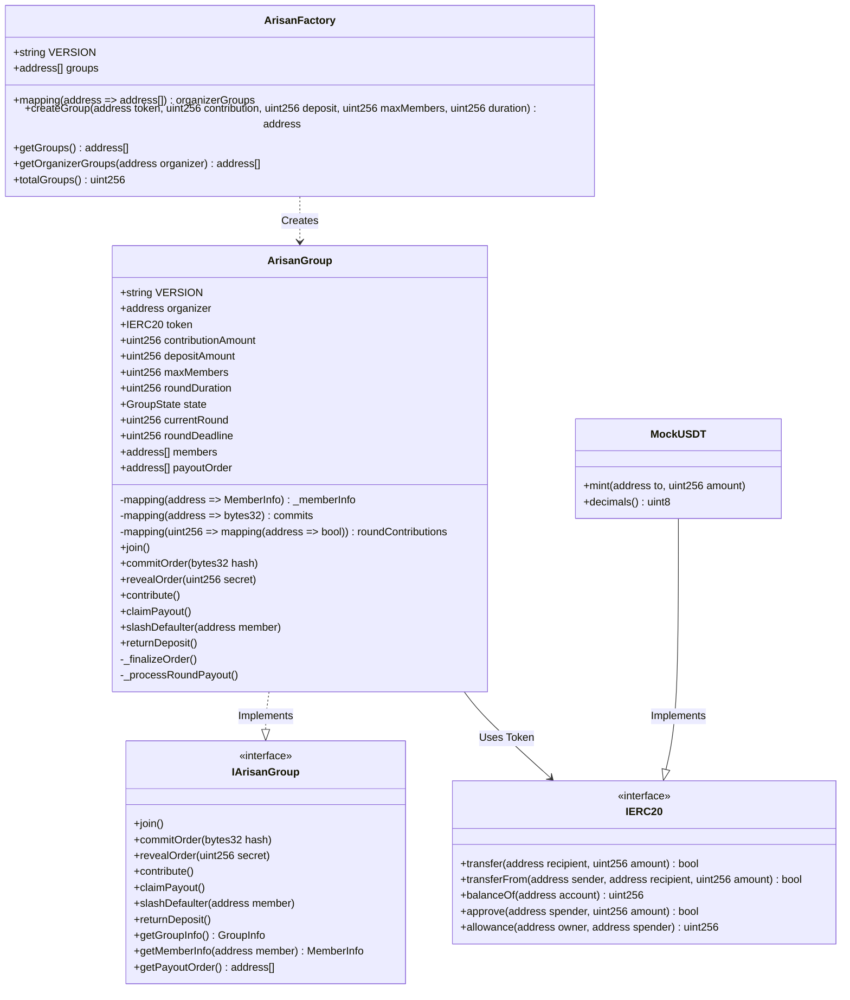
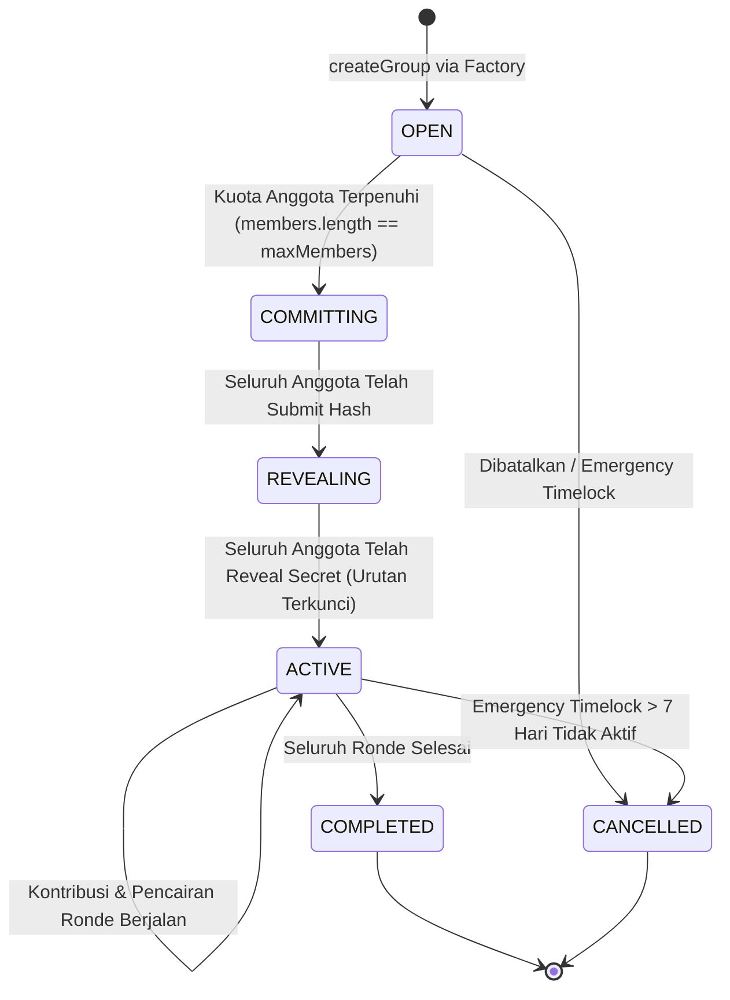
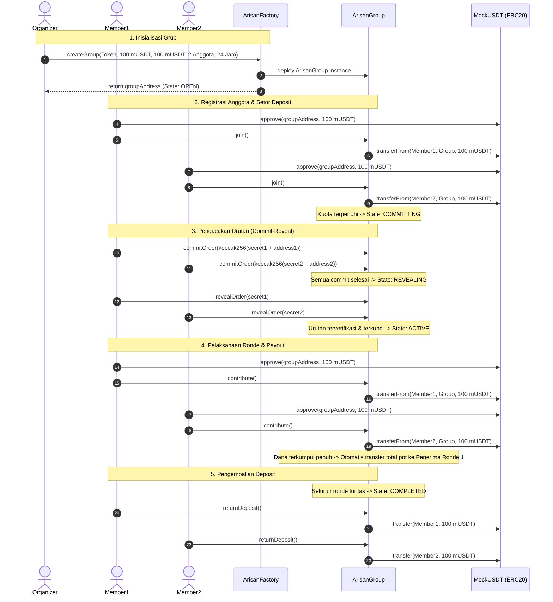

<div align="center">
  
  <h1>ArisanChain</h1>
  <p><strong>Protokol Arisan Terdesentralisasi dan Trustless pada Jaringan BNB Smart Chain</strong></p>
  <p>Submission Resmi untuk Indonesia Web3 Hackathon 2026</p>
  <p>
    <a href="https://frontend-six-tawny-83.vercel.app"><strong>🌐 Live App</strong></a> &nbsp;|&nbsp;
    <a href="https://frontend-six-tawny-83.vercel.app/pitch-deck"><strong> Interactive Pitch Deck (12 Slides)</strong></a> &nbsp;|&nbsp;
    <a href="https://testnet.bscscan.com/address/0xDf76714269D68F78FF491BbDe2e3f331b9af434E"><strong> BscScan Explorer</strong></a>
  </p>
</div>

---

## 1. Ringkasan Eksekutif

ArisanChain adalah implementasi on-chain dari praktik keuangan sosial tradisional Indonesia (arisan) berbasis smart contract di BNB Smart Chain (BSC). Protokol ini mengeliminasi kebutuhan figur bendahara sentral, memitigasi risiko gagal bayar (defaulter) melalui deposit jaminan terikat, dan menjamin penentuan urutan giliran yang adil dan tahan manipulasi melalui skema kriptografi Commit-Reveal.

### 1.1 Perbandingan Model Konvensional vs ArisanChain

| Parameter | Arisan Konvensional | ArisanChain Protocol |
|---|---|---|
| Ketergantungan Kepercayaan | 100% bergantung pada integritas bendahara | Trustless, dieksekusi otomatis oleh Smart Contract |
| Risiko Peserta Kabur | Tinggi, peserta dapat berhenti setelah menerima dana | Diminimalisir dengan Deposit Jaminan dan Auto-Slash |
| Penentuan Urutan Pemenang | Rentan manipulasi atau pengocokan manual yang bias | Algoritma Commit-Reveal on-chain yang verifiable |
| Transparansi Transaksi | Pencatatan manual, rawan selisih | Transparan dan permanen melalui blockchain event log |
| Pengelolaan Kas | Rekening pribadi pengurus | Smart Contract vault terisolasi (Non-Custodial) |

---

## 2. Arsitektur dan Desain Sistem

Sistem dirancang secara modular menggunakan pola Factory Pattern, di mana satu kontrak pabrik menginisiasi dan mencatat setiap instance kontrak grup arisan yang independen.

### 2.1 Diagram Kelas UML (Class Diagram)



---

### 2.2 Diagram Alur Siklus Hidup Grup (State Machine Diagram)

Siklus hidup setiap grup arisan dikontrol secara ketat melalui mesin status (state machine) yang tidak dapat dibalikkan:



---

### 2.3 Diagram Sekuensial: Siklus Arisan Lengkap (Sequence Diagram)

Diagram di bawah ini mengilustrasikan interaksi menyeluruh antara Anggota, Smart Contract ArisanGroup, dan Token ERC20:



---

## 3. Informasi Penerapan Smart Contract (BSC Testnet)

Kontrak telah berhasil dikompilasi, diuji, dan dideploy pada jaringan BNB Smart Chain Testnet (Chain ID: 97).

| Nama Kontrak | Alamat Kontrak | Penjelajah Blok (BscScan) |
|---|---|---|
| **MockUSDT** | `0x79F41C959e47276fD860242413d6fFcE9cad5eA2` | [BscScan Explorer](https://testnet.bscscan.com/address/0x79F41C959e47276fD860242413d6fFcE9cad5eA2) |
| **ArisanFactory** | `0xDf76714269D68F78FF491BbDe2e3f331b9af434E` | [BscScan Explorer](https://testnet.bscscan.com/address/0xDf76714269D68F78FF491BbDe2e3f331b9af434E) |
| **ArisanGroup (Sampel Live)** | `0xADE66d006fA341cD5c3309DBf2e80fFAd719A7d8` | [BscScan Explorer](https://testnet.bscscan.com/address/0xADE66d006fA341cD5c3309DBf2e80fFAd719A7d8) |

### Parameter Grup Sampel Terdeploy:
* **Token:** MockUSDT (`0x79F41C959e47276fD860242413d6fFcE9cad5eA2`)
* **Kontribusi per Ronde:** 100 mUSDT
* **Deposit Jaminan:** 100 mUSDT
* **Kapasitas Anggota:** 3 Peserta
* **Durasi per Ronde:** 86,400 detik (24 Jam)

---

## 4. Mekanisme Keamanan dan Optimasi Gas

1. **Proteksi Reentrancy:**  
   Penerapan `ReentrancyGuard` dari OpenZeppelin pada setiap fungsi eksternal yang melakukan mutasi saldo atau transfer token (`join`, `contribute`, `claimPayout`, `returnDeposit`).
2. **SafeERC20 Implementation:**  
   Pustaka `SafeERC20` digunakan untuk menangani variasi implementasi token ERC20 standar yang tidak selalu mengembalikan nilai boolean secara konsisten.
3. **Konstruksi Deposit Jaminan Penuh:**  
   Aturan validasi konstruktor mewajibkan `depositAmount >= contributionAmount`. Hal ini memastikan bahwa pemotongan deposit (slashing) menutup tepat 100% kewajiban kontribusi anggota jika terjadi gagal bayar.
4. **Custom Errors:**  
   Menggantikan string revert standar dengan Solidity Custom Errors (`revert InvalidState(...)`, `revert NotMember(...)`, dsb.) untuk mereduksi ukuran bytecode kontrak dan menghemat konsumsi gas saat transaksi gagal.
5. **Emergency Timelock:**  
   Mekanisme penarikan darurat terikat waktu (`EMERGENCY_TIMELOCK = 7 days`) yang hanya aktif jika tidak ada interaksi apapun pada kontrak selama lebih dari 7 hari kalender.

---

## 5. Panduan Instalasi dan Pengujian Lokal

### 5.1 Prasyarat Sistem
* Node.js v18.0.0 atau lebih baru
* npm v9.0.0 atau lebih baru
* Ekstensi browser MetaMask

### 5.2 Instalasi Dependensi
```bash
# Clone repository
git clone https://github.com/Vraken9/Arisan.git
cd Arisan

# Instal dependensi smart contract
npm install

# Instal dependensi frontend
cd frontend
npm install
cd ..
```

### 5.3 Kompilasi dan Unit Test Kontrak
```bash
# Kompilasi Smart Contract
npx hardhat compile

# Menjalankan 29 Unit Test Suite
npx hardhat test
```

### 5.4 Eksekusi Script Simulasi Demo (Lokal)
```bash
npx hardhat run scripts/demo.js
```
Script demo mengeksekusi dua skenario:
1. Skenario Operasional Normal: Pendaftaran, pengacakan Commit-Reveal, kontribusi tepat waktu, dan pencairan pot.
2. Skenario Penalti Gagal Bayar: Eksekusi pemotongan deposit jaminan saat peserta melebihi batas waktu deadline.

---

## 6. Menjalankan Aplikasi Frontend

Aplikasi frontend terintegrasi penuh dengan smart contract yang telah aktif di BNB Smart Chain Testnet.

```bash
# Menjalankan frontend development server
npm run frontend
```

Akses browser pada alamat: **`http://localhost:5173`**

### Panduan Interaksi Frontend:
1. Hubungkan MetaMask ke jaringan **BNB Smart Chain Testnet** (Chain ID: `97`, RPC: `https://data-seed-prebsc-1-s1.binance.org:8545`).
2. Gunakan tombol **Faucet mUSDT** pada navigasi atas untuk mencetak token percobaan sebesar 1,000 mUSDT langsung ke alamat wallet Anda.
3. Masuk ke ruang arisan yang terdaftar atau inisiasi grup baru melalui tombol **Buat Grup Baru**.

---

## 7. Struktur Repositori

```
arisan-chain/
├── contracts/
│   ├── ArisanFactory.sol        # Factory Contract
│   ├── ArisanGroup.sol          # Core Arisan Logic & Vault
│   ├── MockUSDT.sol             # ERC20 Mock Token Testnet
│   └── interfaces/
│       └── IArisanGroup.sol     # Interface & Data Structures
├── frontend/
│   ├── src/
│   │   ├── components/          # Komponen UI (Navbar, Modals, Cards)
│   │   ├── config/              # Alamat Kontrak & ABI Jaringan
│   │   ├── utils/               # Web3 Connector & Kriptografi Helper
│   │   ├── App.jsx              # Root Controller & State Manager
│   │   └── index.css            # Desain Sistem Glassmorphism & Token Warna
│   └── index.html               # Entri Utama Frontend
├── scripts/
│   ├── deploy.js                # Deployment Script BSC Testnet
│   ├── mint-tokens.js           # Faucet Multi-Wallet Script
│   └── demo.js                  # Automated Simulation Script
├── test/
│   └── ArisanChain.test.js      # 29 Comprehensive Test Cases
├── deployment.json              # Catatan Alamat Kontrak Terdeploy
├── hardhat.config.js            # Konfigurasi Hardhat & Jaringan BSC
└── package.json                 # Project Manifest & Command Scripts
```

---

## 8. Lisensi dan Pengembang

Proyek ini dirilis di bawah lisensi [MIT](LICENSE). Dikembangkan oleh **ArisanChain Team** sebagai proyek persembahan untuk **Indonesia Web3 Hackathon 2026**.
